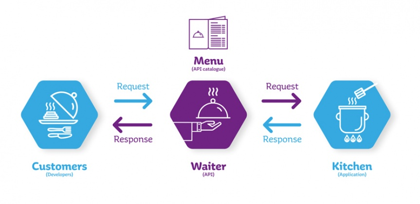

## Apa itu API?

> Repository ini berisi kumpulan API tentang data dan informasi di Indonesia. Di design oleh [@bayugustiparaya](https://bayugustiparaya.github.io/)

API adalah singkatan dari *Application Programming Interface*. API sendiri merupakan *interface* yang dapat menghubungkan satu aplikasi dengan aplikasi lainnya. Dengan kata lain, peran API adalah sebagai perantara antar berbagai aplikasi berbeda, baik dalam satu platform yang sama atau pun lintas platform.

Perumpamaan yang bisa digunakan untuk menjelaskan API adalah seorang pelayan di restoran. Tugas pelayan tersebut adalah menghubungkan tamu restoran dengan juru masak.

Jadi, tamu (*customers*) cukup memesan makanan sesuai daftar menu yang ada (*API Catalogue*) dan pelayan (*waiter / api*) memberitahukannya ke juru masak (*kitchen / application*). Nantinya, pelayan (*waiter / api*) akan kembali ke tamu tadi (*customers*) dengan masakan yang sudah siap sesuai pesanan. Dimana *request* merupakan pesanan tamu. Dan *response* merupakan masakan yang sudah siap. Itulah gambaran tugas dari API dalam pengembangan aplikasi.

Tidak hanya itu, API juga memungkinkan Anda mengembangkan sebuah website dengan berbagai fitur yang lebih lengkap. Jika menggunakan WordPress, Anda bisa melakukan integrasi dengan berbagai platform menggunakan API. Salah satu contohnya adalah WordPress REST API.

Sebagai contoh, ketika Anda menggunakan MailChimp untuk upaya email marketing, Anda perlu melakukan integrasi layanan MailChimp di WordPress Anda dengan bantuan plugin. Kemudian, Anda cukup memasukkan API key yang dibutuhkan agar layanan tersebut berjalan otomatis di website Anda.

## Apa saja API Lokal Indonesia?

Ada gak sih API lokal Indonesia ? Setidaknya kamu pasti pernah membatin bertanya-tanya bukan! Ternyata ada loh, dan banyak. Siapa tau nantinya kamu berencana membuat software menggunakan API dari salah satu yang ada pada 👉 **[list disini](/list_api)**. 

---

Jika ada yang ingin ditambahkan atau dikoreksi bisa WA saya [+6281271077073](https://wa.me/6281271077073) ya! ATAU berkomentar via fitur [Issues](https://github.com/bayugustiparaya/list-api-indonesia/issues) atau langsung edit saja nanti biar didiskusikan terlebih dahulu.